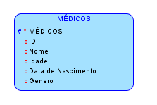

# Mariana guimas database
# 1- Descrição do Trabalho:
Se você pretende abrir consultórios, um centro médico ou prestar serviços para alguma instituição deve tomar algumas decisões importantes. Uma delas é entender  o que é cada tipo de estabelecimento.

Nesta hora, é essencial saber a diferença entre consultórios, clinicas e centros médicos.

Não só os profissionais ficam em dúvida na hora de escolher estes estabelecimentos. Os pacientes também podem ter dificuldades em saber qual utilizar. Por isso, vamos ajudar você a escolher o ideal.

A diferença entre clínica, consultório e centro médico não é tão evidente para leigos e jovens profissionais. Muitos especialistas que desejam abrir uma empresa no ramo da saúde não sabem exatamente em qual tipo ela se enquadrará.

Por isso, nosso objetivo é definir as particularidades desses empreendimentos, para evidenciar o que é comum a cada um para que, ao final do texto, fiquem claras as diferenças entre eles.

Mas afinal, qual a diferença entre consultórios, clinicas e centro médico?

Primeiramente, para entender as diferenças entre consultórios, clínicas e centro médicos você precisa entender como eles funcionam.  Cada um destes estabelecimentos possui uma função específica.

Sendo assim, você precisa estar atento. Em suma, podemos dizer que as diferenças entre estes três estabelecimentos se dão em três grandes aspectos:

Infraestrutura do local;
Atividades desempenhadas;
Jurídico.
Isto significa que cada um destes estabelecimentos apresenta uma infra estrutura determinada. Assim como a infraestrutura, eles também promovem diferentes atividades e devem responder a legislação de forma diferenciada.

Consultório
Em um consultório, os médicos se dedicam ao atendimento do paciente. Em muitos casos, há também outros procedimentos médicos, mas isso não é uma regra. Como o nome indica, o objetivo está nas consultas.

Dois ou mais profissionais podem, também, dividir o espaço de um consultório para oferecer seus serviços de saúde.

Embora estejam juntos na mesma estrutura, a atuação dos médicos é independente: cada um possui uma carteira de pacientes e uma secretária.

Em relação aos custos, os profissionais dividem as despesas da estrutura, isto é, aquelas que dizem respeito a todos.

Mas, embora paguem em conjunto água, telefone, energia elétrica e outras despesas, os honorários não são divididos entre eles.

Legalmente, a abertura de consultórios pode ser feita por pessoa física, ou seja, apenas pelo CPF.

Clínica:
A clínica se diferencia do consultório principalmente por não ter foco apenas no atendimento.

A estrutura desses estabelecimentos é maior e mais bem equipada, mas isso não significa que não há atendimento de pacientes nesses ambientes.

A diferença desse estabelecimento para um consultório consiste na multiplicidade de finalidades da clínica.

Ela pode oferecer outros procedimentos comuns da área médica, como exames, por exemplo. A sua estruturação está alheia à relação de médico e paciente.

Muitos definem uma clínica como um conjunto de consultórios. Embora não seja uma explicação exata e um tanto quanto limitante, ela consegue definir esse tipo de estabelecimento.

Diferente dos consultórios, as clínicas são abertas através de um CNPJ.

Centro médico:
Um centro médico abriga diversas instalações para oferecer serviços de saúde.

Diferentemente de uma clínica ou de um consultório, um centro médico deve integrar, necessariamente, mais de um serviço na mesma estrutura.

Ou seja: enquanto clínicas possuem normalmente profissionais de uma só especialidade, os centros médicos oferecem diversos especialistas, das mais variadas ramificações da medicina.

Mas, na prática, dificilmente você vê a diferença entre esse estabelecimento e uma clínica. Os próprios centros médicos costumam utilizar os termos como se fossem sinônimos.

Podemos dizer, então, como na definição anterior, que um centro médico é um conjunto de clínicas (dessa vez, com profissionais de especialidades diferentes). Novamente, não é uma definição precisa, mas ajuda a esclarecer a diferença de uma maneira grosseira.

Como abrir um consultório, clínica ou centro médico?
Do mesmo modo que os serviços prestados, as exigências para a abertura de um consultório, clínica ou centro médico também apresentam diferenças.

Saiba o que você precisa para abrir cada um deles. Aproveite para começar da melhor forma o atendimento do seus pacientes!

Quais os documentos necessários para abrir um consultório?
O processo de abertura de um consultório é bem simples. Principalmente porque não requer CNPJ. Você pode abrir consultórios apenas com o CPF.

Apesar disto, você precisará de alguns documentos. São eles:

Alvará da vigilância;
CNES (Cadastro Nacional Estabelecimento de Saúde) — documento necessário para o credenciamento de médicos no que diz respeito a convênios;
Alvará de funcionamento;
Documentação do LIMPURB;
Receituários;
CCM Pessoa Física.

Com estes documentos em mãos, já pode  começar a trabalhar e receber seus pacientes.

Não esqueça de focar no atendimento humanizado para aumentar o fluxo de usuários.

Conheça os documentos necessários para abrir uma clínica
Já os interessados em abrir uma clínica médica, diferentemente de um consultório, devem abrir um CNPJ.  Você também deverá entrar em contato com a prefeitura e a secretária de saúde do seu município.

Isto porque cada cidade determina documentos especiais para esta abertura. Além do CNPJ você irá precisar de:

Cópia autenticada do RG e CPF;
Folha espelho do IRPF;
IPTU do imóvel;
Cópia do Contrato de Locação ou Compra e Venda;
Alvará de funcionamento;
Alvará da Vigilância Sanitária;
Além dos documentos necessários, não esqueça de montar um plano de negócios quando for abrir sua clínica.

Igualmente importante, é avaliar a estrutura necessária para atender bem e disponibilizar bons serviços no local.

E os documentos necessários para abrir um centro médico?
Da mesma forma que uma clínica, o Centro médico também exige vários documentos para a abertura e funcionamento do local.  Para abrir um centro médico você irá precisar de:

CNPJ;
Definir o regime tributário para o seu consultório médico;
Definição do CNAE;
Alvará de funcionamento;
Licença sanitária;
Certificado de conformidade do Corpo de Bombeiros;
Certificado de limpeza urbana.

Lembre-se que todos estes documentos devem ser solicitados ao seu município e as entidades e órgãos devidos.  Uma dica importante é contar com um contador para abertura do seu CNPJ.

Além da abertura do CNPJ ele pode ajudar na organização das suas finanças nesta fase, junto com o auxílio de um software médico.

Mas, não é só isso. A responsabilidade civil de cada instituição também é distinta. Acompanhe a seguir!

Responsabilidade civil: entenda as diferenças entre clínica, consultório e centro médico
Uma das grandes diferenças entre clínicas, consultórios e centros médicos é com relação a responsabilidade civil. Antes de mais nada, quando se trata dos consultórios, cada médico responderá legalmente pelo seu próprio trabalho.

Já em relação a clinicas e centros médicos a responsabilidade é diferente. Estes locais são CNPJs, ou seja, empresas. Portanto, é a empresa que responderá caso haja algum problema.

Apesar disto, tanto os consultórios quanto as clínicas e centros médicos devem trabalhar seguindo as orientações do conselho de sua especialidade.

Então, qual devo escolher na hora de abrir o meu negócio?
Agora que você já entende as diferenças entre eles, é só definir os objetivos e partir para ação.

Para escolher qual das instituições preferir, vai depender de muita coisa. Na verdade, analise quais tipos de serviços médicos gostaria de oferecer à população, qual o investimento você tem disponível, se quer ter sócios ou não.

Para oferecer apenas consultas médicas, você pode começar abrindo um consultório.

As clínicas são indicadas quando você pretende oferecer atendimento com mais de um profissional da mesma especialidade ou acompanhamento multidisciplinar.

Os centros médicos geralmente são mais indicados para quem quer oferecer diversos serviços em saúde, necessariamente com mais de uma especialidade. É comum nesses casos o investimento ser maior para a infraestrutura adequada.

Consultórios, centros médicos ou clínicas, o que importa antes de mais nada é oferecer um bom serviço, fazer um marketing médico estratégico e ter um bom planejamento para crescer com sustentabilidade.

Considerações finais
Embora as diferenças sejam pequenas e difíceis de serem vistas, depois que compreendemos as finalidades de cada estabelecimento de saúde, elas ficam evidentes.

Além de clínicas, consultórios e centros médicos, a área da saúde possui muitos outros pontos de atendimentos que também costumam confundir as pessoas.

Os postos de saúde, por exemplo, são unidades de assistência que costumam abrigar profissionais de nível médio e com médicos ao entorno. Eles diferem das unidades básicas de saúde, que, como o nome indica, oferecem apenas os serviços fundamentais.

Sobre o iMedicina
Aqui no iMedicina, somos especializados em auxiliar clínicas e consultórios em 3 pilares:

Atendimento ao paciente:
Temos soluções de agendamento online, controle financeiro, prontuário eletrônico, modelos pré-definidos de atestado e dezenas de outras ferramentas.

Relacionamento com pacientes para fidelização e recomendações:
Crie fluxos automatizados para cada situação que você desejar, para manter seus pacientes informados e próximos.

Seu paciente fez aniversário? Ele poderia receber uma mensagem sua desejando felicitações.

Atendeu um paciente diabético? Seria legal se no dia seguinte ele recebesse um e-mail com tudo sobre a doença, concorda?

Quer saber o que o paciente achou da sua consulta? Seria legal que ele respondesse uma pesquisa de satisfação, não é?

Automatize essas tarefas e muito mais com o iMedicina.

Atração de novos pacientes para sua clínica:
Auxiliamos profissionais de saúde a conseguirem mais pacientes através da tecnologia.

Criamos os sites médicos mais fantásticos que você já viu, sistema de agendamento online pelo paciente, tudo integrado ao software e em tempo real, acessível de qualquer lugar que tenha uma conexão com a internet.

Experimente o prontuário eletrônico gratuito iMedicina e mantenha seu consultório ou clínica com tecnologias de ponta focadas no seu paciente! Para se cadastrar basta ter um e-mail válido e não é necessário cartão de crédito!

# 2- Modelo E-R:
bla bla bla bla

## 2.1- Descrição da BD:
bla bla bla

## 2.2- Entidades-tipo:
As entidades-tipo, deste consultório médico, são:
MEDICO
CONSULTAS
PACIENTES
FUNCIONARIOS

## 2.3- Entidades-fracas:
As entidades- fracas, deste consultório médico, são:
MORADA,
ESPECIALIDADES
HORARIO_ATENDIMENTO

## 2.4- Atributos:
Os atributos, deste meu consultório médico, são:
MÉDICO: CRM,      Nome, {ESPECIALISTAS_EspecialidadeId}
        PK U *  , *.  , *

PACIENTE: N_Bilhete_Id, Nome,RG, CPF, Sexo, Data_de_Nascimento, Nome_Convenio
          PK U *      , *   ,* , *  , o.  , *                 , *

HORACIO_ATENDIMENTO: ESPECIALIDADES_EspecialidadesId, Telefone, Telemovel, Horarios
                     *                              , *       ,*         , *

CONSULTA: TimeStamp, MEDICO_CRM, PACIENTE_PacienteId, ESPECIALIDADES_EspecialidadeId
          *        , *        , *

MORADA: Rua, Num, Codigo_Postal, Telefone, Telemovel
       *   ,*   , *.           , o U    , * U  

## 2.5- Relações:
As relações deste meu consultório médico, são:
Relacionamento entre as entidades.
a. ATENDIMENTO(MEDICO,PACIENTES),  
Um médico atende a muitos pacientes. Um paciente pode ser atendido por muitos médicos
b. CONSULTAS(MEDICO, PACIENTE)
Cada consulta é realizada por um médico. Um médico realiza muitas consultas.
c. Cada consulta é realizada para um paciente. Um paciente pode realizar muitas consultas.

## 2.6 Modelo Lógico:
bla bla

## 2.7 Modelo Relacional:
bla bla

# 3- Exemplos de uso da syntax dos comandos SQL:

## 3-1 Geral:

## 3-2 SQL Server/Oracle/ MS Access:

## 3-3 MySQL:

# 4- Conclusão:
Bla bla bla

# 5- Bibliografia:
https://blog.imedicina.com.br/diferenca-entre-consultorios-clinicas-e-centros-medicos/

